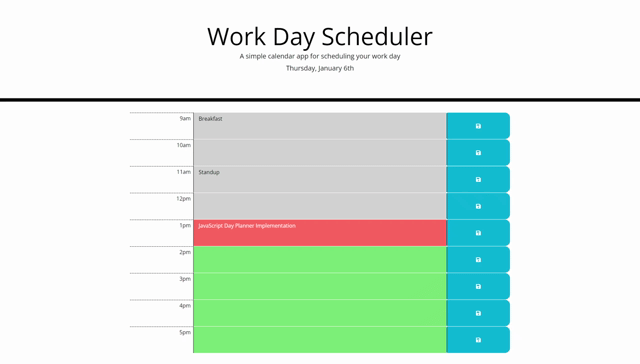

# day-planner

## Description

A 9-5 day planner implemented using jQuery and Moment.js. Based on the current hour, rows will change colors with GREY being a past hour, RED being the current hour, and GREEN being an upcoming hour. After adding a task to the hour of your choosing you can save to come back to it.

## Website

[Here!](https://ezequielmejiasmelo.github.io/day-planner/)

## Tech Stack

- HTML
- CSS
- JavaScript
- jQuery
- Moment.js

## Support

Contact me if you have any questions

- [LinkedIn](https://www.linkedin.com/in/ezequiel-mejias-melo)
- [Github](https://github.com/EzequielMejiasMelo)